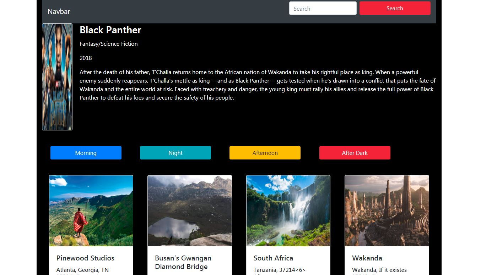

# shotz

## Technologies Used:

    * HTML5 
    * CSS 
    * JavaScript 
    * Bootstrap 4 
    * ES6 Modules 

## Description 

You will see a movie with a search button, where you can filter the locations it was shot. You will also see buttons which will filter by the time of the day for the movie shots. 

## Screenshots

## Contributor

    * Feven Mulugeta

## Instructions 

1. Go to: `https://www.npmjs.com/package/http-server` and install "http-server".  
2. Navigate to the project folder in command line interface and type: `http-server -p 8080`  
3. This will show at: `http://localhost:8080` in your internet browser. 
